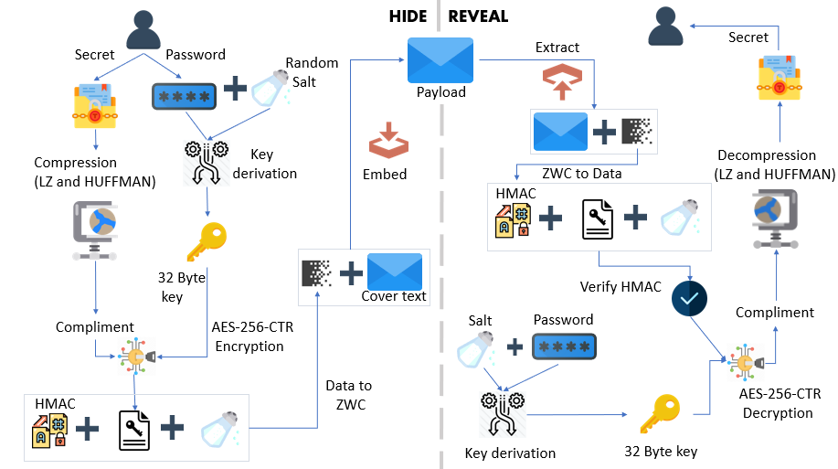

<h1 align="center">
  <br>
  
  <br>
  <br>
  <span>StegCloak</span>
  <br>
  
  <a href="https://www.npmjs.com/package/stegcloak">  </a>
   <a href="https://github.com/sbilly/awesome-security">
  
  </a>
  
  <br>
</h1>
<h4 align="center">The Cloak of Invisibility for your texts</h4>

<p align="justify">
StegCloak is a pure JavaScript steganography module designed in functional programming style, to hide secrets inside text by compressing and encrypting the secret before cloaking it with special unicode invisible characters. It can be used to safely watermark strings, invisible scripts on webpages, texts on social media or for any other covert communication. Completely invisible!. See how it works in-depth in this medium <a href="https://blog.bitsrc.io/how-to-hide-secrets-in-strings-modern-text-hiding-in-javascript-613a9faa5787">article</a> or watch our <a href="https://www.youtube.com/watch?v=RBDqZwcGvQk">demo</a> to know what it does
<p>

<a href="https://standardjs.com" style="position: absolute; top: 100px; right: 20px; padding: 0 0 20px 20px;"></a>

## Features
- Protect your invisible secret using passwords and HMAC integrity
- Cryptographically secure by encrypting the invisible secret using AES-256-CTR.
- Uses 6 Invisible characters in unicode characters that works everywhere in the web.

  Including the most important ones Tweets, Gmail, Whatsapp, Telegram, Instagram, Facebook etc. 

- Maximum Compression to reduce the payload (LZ, Huffman).
- Completely invisible, uses Zero Width Characters instead of white spaces or tabs.
- Super fast! Hides the Wikipedia page-source for steganography (800 lines and 205362 characters) within a covertext of 3 words in under one second.
- Hiding files in strings can be achieved by uploading the file to cloud and stegcloaking the link in the string
- Written in pure functional style.
- Usage - Available as an API module, a CLI and also a <a href='https://stegcloak.surge.sh'>Web Interface</a> (optimized with web workers). 

<br>


## Installing

Using npm,

```bash
$ npm install -g stegcloak
```
Using npm (to use it locally in your program),

```bash
$ npm install stegcloak
```

## How it works



## CLI Usage

### Hide

```bash
$ stegcloak hide
```
Options:

```
  hide [options] [secret] [cover]

  -fc, --fcover <file>      Extract cover text from file
  -fs, --fsecret <file>     Extract secret text from file
  -n, --nocrypt             If you don't need encryption (default: false)
  -i, --integrity           If additional security of preventing tampering is needed (default: false)
  -o, --output <output>     Stream the results to an output file
  -c, --config <file>       Config file
  -h, --help                display help for command

```

### Reveal

```bash
$ stegcloak reveal       
```
Options:

```
  reveal [message]

  -f, --file <file>       Extract message from file
  -cp, --clip             Copy message directly from clipboard
  -o, --output <output>   Stream the secret to an output file
  -c, --config <file>     Config file
  -h, --help              display help for command
```
### Additional support

- **STEGCLOAK_PASSWORD** environment variable if set will be used by default as password

- **Config file** support to configure Stegcloak CLI and to avoid prompts. <a href='https://github.com/KuroLabs/stegcloak/wiki/Stegcloak---configuration-file'> Read Config docs here</a>

## API Usage

```javascript
const StegCloak = require('stegcloak');

const stegcloak = new StegCloak(true, false);  // Initializes with encryption true and hmac false for hiding

// These arguments are used only during hide

// Can be changed later by switching boolean flags for stegcloak.encrypt and stegcloak.integrity

```
###### What's HMAC and do I need it?

<p align='justify'>
HMAC is an additional fingerprint security step taken towards tampering of texts and to verify if the message received was actually sent by the intended sender. If the data is sent through WhatsApp, Messenger or any social media platform, this is already taken care of! However, if you are using StegCloak in your program to safely transmit and retrieve, this option can be enabled and StegCloak takes care of it.
</p>

### Hide

###### `stegcloak.hide(secret,password,cover) -> string`

```javascript
const magic = stegcloak.hide("Voldemort is back", "mischief managed", "The WiFi's not working here!");

// Uses stegcloak.encrypt and stegcloak.integrity booleans for obfuscation

console.log(magic);  // The WiFi's not working here!

```

### Reveal

###### `stegcloak.reveal(data, password) -> string`

```javascript
const secret = stegcloak.reveal(magic, "mischief managed");

// Automatically detects if encryption or integrity checks were done during hide and acts accordingly

console.log(secret); // Voldemort is back

```
This amazing [blog](https://iwantmore.pizza/posts/zwc-fingerprint.html) by [Francesco Soncina](https://twitter.com/phraaaaaaa) shows how you could use stegcloak API to watermark any text in your website.

#### Important
<p align='justify'>
StegCloak doesn't solve the Alice-Bob-Warden problem, it's powerful only when people are not looking for it and it helps you achieve that really well, given its invisible properties around the web! It could be safely used for watermarking in forums, invisible tweets, social media etc. Please don't use it when you know there's someone who is actively sniffing your data - looking at the unicode characters through a data analysis tool. In that case, even though the secret encoded cannot be deciphered, the fact lies that the Warden (middle-man) knows some secret communication took place, because he would have noticed an unusual amount of special invisible characters.
</p>

## Resources 

The following papers were referred to for insight and understanding of using Zero Width Characters in steganography. 

- Milad Taleby Ahvanooey, Qianmu Li , Jun Hou, Ahmed Raza Rajput and Chen Yini
```
Modern Text Hiding, Text Steganalysis, and Applications: A Comparative Analysis
```

- Taleby Ahvanooey, Milad & Li, Qianmu & Hou, Jun & Dana Mazraeh, Hassan & Zhang, Jing.
```
AITSteg: An Innovative Text Steganography Technique for Hidden Transmission of Text Message via Social Media.
IEEE Access
```

## Contributing

Pull requests are welcome. For major changes, please open an issue first to discuss what you would like to change.

## License

[MIT](https://github.com/KuroLabs/stegcloak/blob/master/LICENSE.md) - Copyright (c) 2020 [Jyothishmathi CV](https://github.com/JyothishmathiCV), [Kandavel A](https://github.com/AK5123), [Mohanasundar M](https://github.com/mohanpierce99)

## Acknowledgements
The StegCloak logo was designed by <a href="https://www.flaticon.com/authors/smashicons" title="Smashicons">Smashicons</a>.
