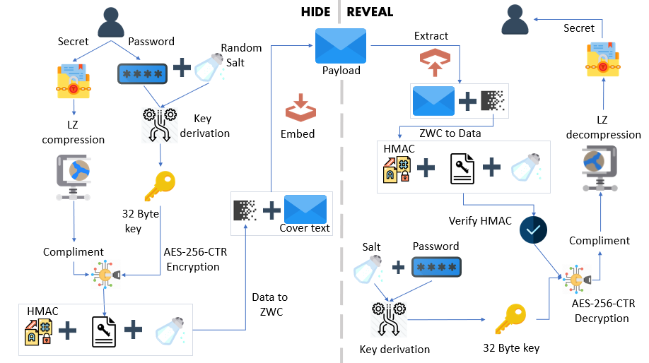

<h1 align="center">
  <br>
  
  <br>
  <br>
  <span>StegCloak</span>
  <br>
  <br>
</h1>

<h4 align="center">The Cloak of Invisibility for your texts</h4>

StegCloak is a pure JavaScript steganography module designed in functional programming style, to hide text in plain sight - with key features like encryption and top-notch text compression. It can be used in social media or for any other covert communication.


## Features

- Cryptographically secure by encrypting the invisible secret
- Compression to reduce the payload
- Completely invisble, uses Zero Width Characters instead of white spaces or tabs
- Additional HMAC integrity
- Usage - Available as an API module, a CLI and also a <a href='https://stegcloak.surge.sh'>Web interface</a>. Works everywhere!
- Written in pure functional style

## Installing

Using npm,

```bash
$ npm install -g stegcloak
```
Using npm (to use it locally in your program),

```bash
$ npm install stegcloak
```

## How it works



## CLI Usage

### Hide

```bash
stegcloak hide <secret> <password> -c <covertext>
```
Options:

```
  -c, --cover <covertext>  Text that you want to hide your secret within
  -cp, --clip              Copy Data directly from clipboard
  -n, --nocrypt            If you don't need encryption (default: false)
  -i, --integrity          If additional security of preventing tampering is needed (default: false)
  -h, --help               display help for command
```


### Reveal

```bash
stegcloak reveal <password> -cp
```
Options:

```
  -cp, --clip        Copy Data directly from clipboard
  -d, --data <data>  Data to be decrypted
  -h, --help         display help for command
```

## API Usage

```javascript
const StegCloak = require('stegcloak');  

const stegcloak = new StegCloak(true,false);  // Initializes with encryption true and hmac false

//Can be later changed by switching boolean flags for stegcloak.encrypt and stegcloak.integrity

```
###### What's HMAC and do I need it?
<p align='justify'>
HMAC is an additional fingerprint security step taken towards tampering of texts and to verify if the message received was actually sent by the intended sender, ideally if the data is sent through whatsapp,messenger or possibly any social media this is already taken care of ! But if you are using stegcloak in your program to safely transmit and retrieve, this option can be enabled and stegcloak takes care of it.
</p>

### Hide

###### `stegcloak.hide(message,password,cover) -> string`

```javascript
const magic = stegcloak.hide(
  {message: "Voldemort is back", password: "mischief managed", cover: "The WiFi's not working here!"},
  false, true); // false for HMAC integrity,true for encryption

console.log(magic);  //The WiFi's not working here!

```

### Reveal

###### `stegcloak.reveal(data,password) -> string`

```javascript
const secret=stegcloak.reveal(magic, "mischief managed");

console.log(secret); //Voldemort is back
```

## Contributing

Pull requests are welcome. For major changes, please open an issue first to discuss what you would like to change.

## License

[MIT](https://github.com/KuroLabs/stegcloak/blob/master/LICENSE.md) - Copyright (c) 2020 [Jyothishmathi CV](https://github.com/JyothishmathiCV), [Kandavel A](https://github.com/AK5123), [Mohanasundar M](https://github.com/mohanpierce99)